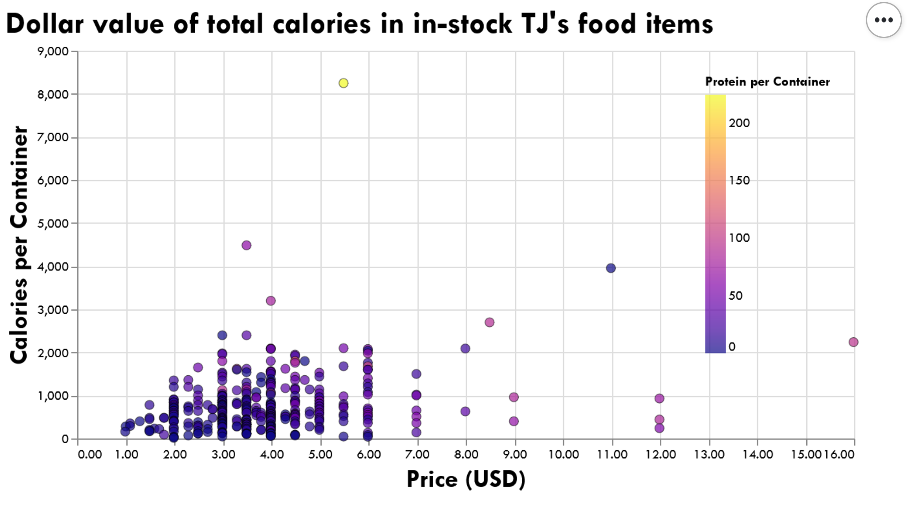

## Tallying Joules

Inspired by [cmoog](https://github.com/cmoog/traderjoes)'s price tracker, this project combines one grocery store's product nutrition and price data to figure the most dollar-efficient way to purchase protein and calories.

Currently, 
* `tj_extract_data.ipynb` is where I have been learning how to access the API and clean its unexpected outputs,
* `tj_analysis_scratchwork.ipynb` is where I have been testing out visualizations in Altair, and
* `tj_streamlit.py` is where I am trying out Streamlit to make a quick way to view 

In my next updates, I want to make the Streamlit app interactive, allowing you to select how much of the full grocery product data set you see on each of the charts (e.g. bar chart of the top *n* most protein-dense products, scatter plot of the top *n* most calorie-filled products).

