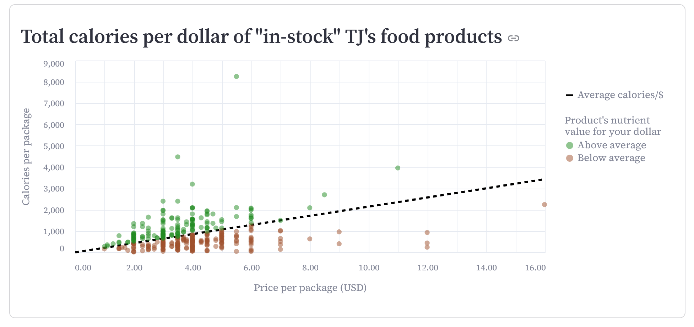

## Tallying Joules: Exploring TJ's Grocery Product Data

**UPDATE**: My code now hits a 403 error when trying to access TJ's GraphQL API. It appears that the grocery item database is no longer open to all comers. I will have to get by with the data I saved in 2025, or get more recent data by scraping.

Inspired by [cmoog](https://github.com/cmoog/traderjoes)'s price tracker, this project combines TJ's product nutrition and price data to figure out some of the most dollar-efficient ways to purchase protein and calories.

Currently, 
* [`tj_extract_data.ipynb`](./tj_extract_data.ipynb) is where I have been learning how to access the API and clean its unexpected outputs,
* [`tj_dataviz_brainstorm.ipynb`](./tj_dataviz_brainstorm.ipynb) is where I have been testing out visualizations in Altair and spot-checking data issues, and
* [`tj_streamlit.py`](./tj_streamlit.py) is where I am trying out Streamlit to make a semi-interactive dashboard.

The deployed mini-dashboard can be found at [tallying-joules.streamlit.app](https://tallying-joules.streamlit.app/).

### To run Streamlit demo locally
Activate the virtual environment: `.venv\Scripts\activate`

Then `streamlit run .\tj_streamlit.py`