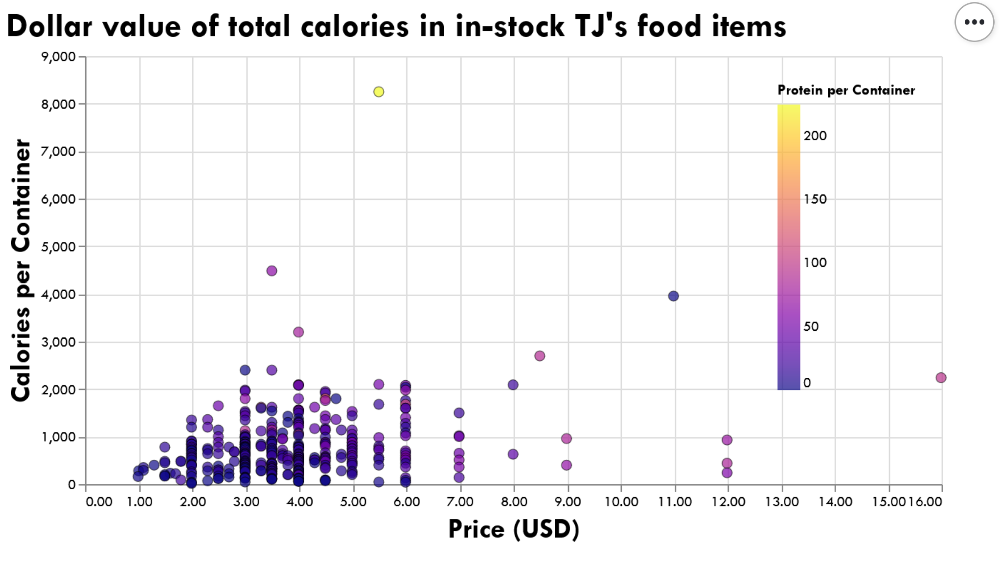

## Tallying Joules

**UPDATE**: My code now hits a 403 error when trying to access TJ's GraphQL API. It appears that the grocery item database is no longer open to all comers. I will have to get by with what I saved in 2025.

Inspired by [cmoog](https://github.com/cmoog/traderjoes)'s price tracker, this project combines one grocery store's product nutrition and price data to figure the most dollar-efficient way to purchase protein and calories.

Currently, 
* `tj_extract_data.ipynb` is where I have been learning how to access the API and clean its unexpected outputs,
* `tj_analysis_scratchwork.ipynb` is where I have been testing out visualizations in Altair, and
* `tj_streamlit.py` is where I am trying out Streamlit to make a quick, semi-interactive dashboard

In my next updates, I want to make the Streamlit app interactive, allowing you to select how much of the full grocery product data set you see on each of the charts (e.g. bar chart of the top *n* most protein-dense products, scatter plot of the top *n* most calorie-filled products).

TODO
* Data validation/sanity checking for cases when the price of a single granola bar is assigned to a box of 10, for example.
* Cache, pre-clean dataframes for the 2-3 charts I want to do under `notes/viz-ideas.md`

### To run streamlit demo
Activate the virtual environment: `.venv\Scripts\activate`

Then `streamlit run .\tj_streamlit.py`